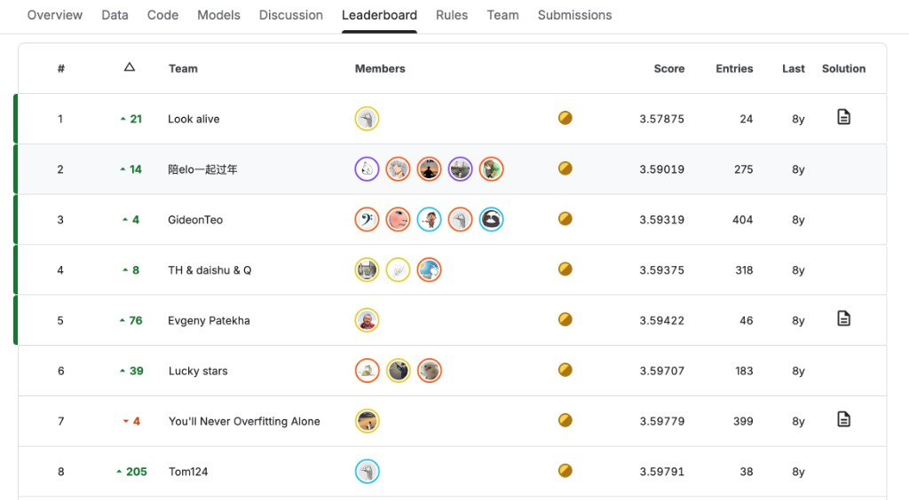
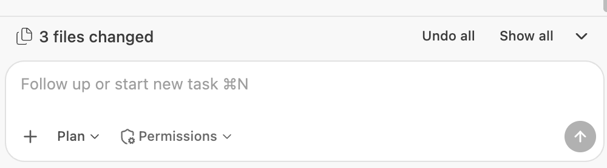
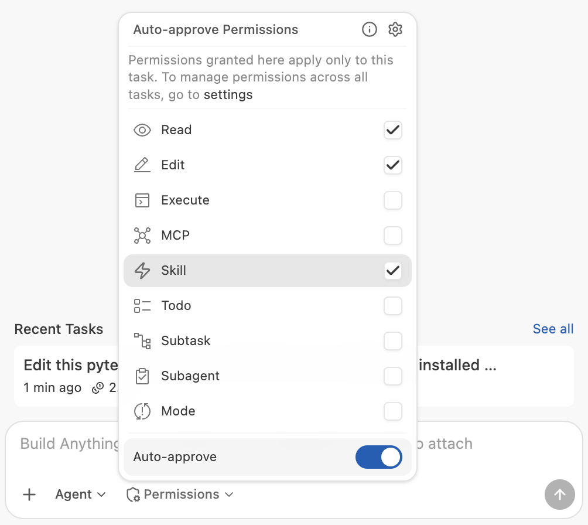

Work **in Bob** (IDE or CLI) with the lab skills. Every Kaggle file must be produced there, then uploaded with a Skore Hub **EstimatorReport URL** in the Submission Description. See the [competition rules](https://www.kaggle.com/competitions/bobathon-esilv/rules).

Put a **new** hub report key for each Kaggle file (`01_dummy`, `02_ridge`, …), and write the file to `submissions/<report-key>.csv` (e.g. `submissions/02_ridge.csv`) so the filename matches the key. Do **not** use the reserved key `eda` for a model.

Join Kaggle and form your team **before** you install Python on your machine.

## 1. Join Kaggle and form a team

**Kaggle** is a website for data-science competitions: you download the data, upload a prediction file, and get a public score on a **leaderboard**. This lab’s private competition lives there. You need a free Kaggle account.



*Example leaderboard — teams ranked by score (lower is better here). Yours will look like this after the first Submissions.*

Open the competition and accept the rules: [https://www.kaggle.com/competitions/bobathon-esilv/](https://www.kaggle.com/competitions/bobathon-esilv/).

Join the competition with this invite: [https://www.kaggle.com/t/ebdc8b0380e44a389f9f01e446782a09](https://www.kaggle.com/t/ebdc8b0380e44a389f9f01e446782a09).

Then form **one Kaggle team** (maximum four people). Remember the **exact team name**. You will reuse it as the Skore Hub workspace name in step 3.

## 2. Python

You need **Python 3.12 or newer** on your `PATH`. Check:

```bash
python --version
```

If that fails, try `python3 --version`. Use that same command (`python` or `python3`) for the rest of this lab. Install Python from [python.org](https://www.python.org/downloads/).

On Windows, leave **Add python.exe to PATH** checked.

On Debian and Ubuntu, the virtual-environment module is a separate package. Install it for the interpreter you will use:

```bash
sudo apt install python3-venv
```


## 3. Hub account and team workspace

Create (or sign in to) a Skore Hub account on the **custom lab hub**: [https://skore.probabl.ai](https://skore.probabl.ai).

**One Hub workspace per Kaggle team — not one per person.**

1. **One** teammate creates the workspace.
2. The workspace **name must match the Kaggle team name** (no `/` in the name; if Hub rejects spaces or punctuation, use the same words with hyphens).
3. That person **invites the other teammates** into that workspace.
4. Everyone else **joins the invite**. Do not create a second workspace.

You will use **Bob IDE or Bob CLI** plus **skore** for every Submission - not Cursor, Claude Code, Copilot, ChatGPT, or Kaggle Notebooks.

## 4. Allow Bob to use the lab skills

Bob asks for permission before it uses a skill unless **Skill** is checked in its Permissions menu. If you miss or decline that prompt, Bob works without the lab skills, so check it once:

1. Open this project folder in Bob IDE and start a chat.
2. At the bottom of the chat input, click the **Permissions** button, right next to the Mode selector.

   

3. The menu lists the actions Bob can do without asking first: Read, Edit, Execute, MCP, Skill, Todo, Subtask, Subagent, and Mode. Check **Skill**, and leave the **Auto-approve** switch at the bottom turned on.

   

These permissions apply only to the current chat. If you start a new chat, open **Permissions** again and make sure **Skill** is still checked.

## 5. Install skore and check your setup

From the repo root, after you are in the team Hub workspace.

Use the `python` or `python3` command from step 2 on the `venv` line. On Linux that is often `python3`, until the virtual environment exists. After activation, `python` is the virtual environment.

These commands create the environment, install the Skore command-line tool and the lab skills for Bob, sign you in, and run the setup checks. Run the whole block in one terminal so activation stays in effect.

Note: for the `skore agent` command replace bobide by bob if you want to use the CLI

**macOS and Linux**

```bash
python -m venv --prompt bobathon .venv
source .venv/bin/activate
python -m pip install -r requirements.txt
skore skills install all --repo probabl-ai/skills-hackathon --agent bob
python scripts/skore-agent
python -m pytest
```

**Windows (PowerShell)**

```powershell
Set-ExecutionPolicy -Scope Process -ExecutionPolicy Bypass #required for Activate.ps1 to run
python -m venv --prompt bobathon .venv
.venv\Scripts\Activate.ps1
python -m pip install -r requirements.txt
skore skills install all --repo probabl-ai/skills-hackathon --agent bob
python scripts/skore-agent
python -m pytest
```

`python scripts/skore-agent` opens a browser so you can sign in at [https://skore.probabl.ai](https://skore.probabl.ai). It writes `.skore` only. If you belong to more than one Hub workspace, it asks you to pick your team workspace.

The last line, `python -m pytest`, runs the setup checks. Each test checks one part of this guide:

| Test | What it checks |
| --- | --- |
| `test_python_version_is_3_12_or_newer` | Python 3.12+ (step 2) |
| `test_virtual_environment_is_active` | you are using the repo's `.venv` (step 5) |
| `test_skore_cli_is_installed` | `skore-cli` is installed (step 5) |
| `test_bob_skills_are_installed` | every lab skill is in `.bob/skills/` (step 5) |
| `test_skore_file_is_complete` | `.skore` exists and points to the lab hub (step 5) |
| `test_hub_accepts_the_api_key` | Skore Hub accepts your API key, so your account and team workspace work (steps 3 and 5) |
| `test_bob_skill_permission_is_toggled` | **Skill** is ticked in Bob's Permissions menu in your latest Bob chat on this repo (step 4) |

You are ready for [DAY1.md](DAY1.md) when the last line says `all passed`. If a test fails, its message says which command to run again. Fix it and re-run `python -m pytest` until everything passes.
